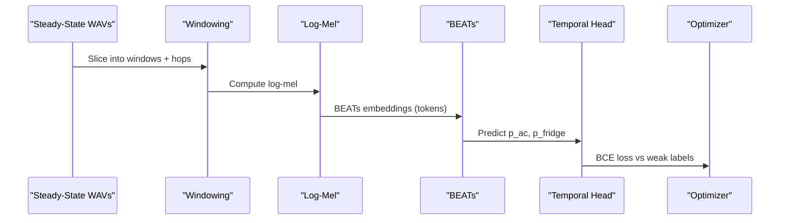
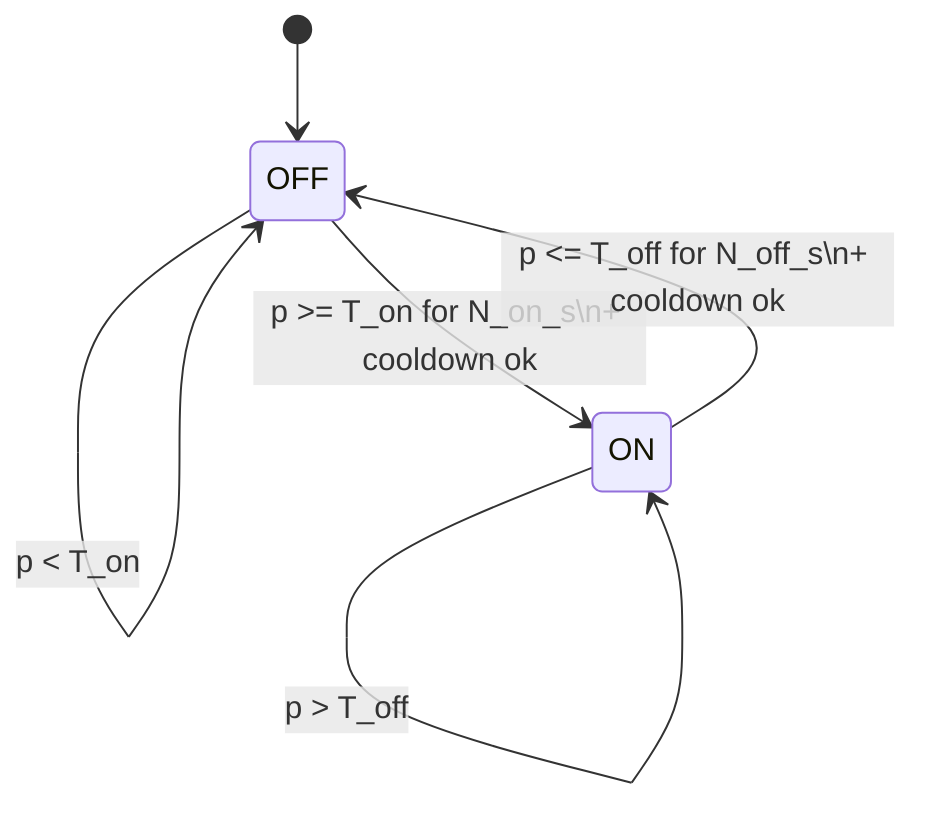

# SPEC: Live Appliance On/Off Detection via Audio (BEATs-First)

## 1) Purpose and Scope
Build a real-time system that listens to apartment audio and emits clean **on/off events** for two appliance sources:
- **AC present**
- **Fridge present**

The system is optimized for:
- Tiny, weakly labeled data (steady-state clips only).
- Real-time, low-latency inference on a MacBook.
- Stable, human-sensible event detection without flapping.

Out of scope (for this iteration):
- Speaker diarization or generic sound classification.
- Multi-room localization.
- Training with rich on/off boundary labels (future work).

---

## 2) System Overview
A “BEATs-first” pipeline: **pretrained BEATs encoder** → **small temporal head** → **probability streams** → **hysteresis state machine** to convert presence into events.

```mermaid
flowchart LR
  MIC[Mic / CoreAudio] --> CHUNK[1s Audio Chunks]
  CHUNK --> RING["Ring Buffer (6s)"]
  RING --> WIN["Inference Window (2-4s)"]
  WIN --> FEAT["Log-Mel (128 bins, 25ms/10ms)"]
  FEAT --> BEATS["BEATs Encoder (frozen or light FT)"]
  BEATS --> HEAD["Temporal Head (multi-label)"]
  HEAD --> PROB[p_ac, p_fridge per hop]
  PROB --> SMOOTH[Median + EMA]
  SMOOTH --> HYST[Hysteresis + Hold Times]
  HYST --> EVENTS[On/Off Events]
  EVENTS --> LOG[Event Log / UI / API]
```

---

## 3) Data and Labels
**Data available:** `./samples` contains 3-minute, steady-state `.wav` files for each appliance state.
- States: **none**, **AC only**, **fridge only**, **both**.
- Labels are **weak**: presence is known for entire file, but **transition boundaries are not**.

**Implications:**
- Train the model as **presence detection**, not transition detection.
- Extract on/off events using **probability smoothing + state machine**.

---

## 4) Model Architecture

### 4.1 Audio Preprocessing (BEATs-compatible)
- **Resample**: 44.1 kHz → **16 kHz** using a high-quality bandlimited resampler.
- **Log-mel filterbanks**: **128 bins**, **25 ms window**, **10 ms hop**.

### 4.2 BEATs Encoder
- Use a large pretrained BEATs model as a **frozen feature extractor** initially.
- Use **time-resolved token embeddings** (not just a single pooled vector).
- Optional (later): unfreeze last N blocks, or apply LoRA/adapters.

### 4.3 Temporal Head (multi-label)
- Inputs: sequence of BEATs time tokens from the inference window.
- Outputs: per-window probabilities:
  - `p_ac_present`
  - `p_fridge_present`
- Head options (pick 1):
  - **1D CNN + (Bi)GRU**
  - **Conformer-lite**
  - **Transformer encoder + attentive pooling**

**Loss:** multi-label BCE with logits (sigmoid outputs).

---

## 5) Training Pipeline

**Windowing for training**
- Use the same window/hop as inference for consistency.
- Each window inherits file-level presence labels.
- Multi-label: both appliances can be on simultaneously.

**Fine-tuning strategy (in order):**
1. **Linear probe:** freeze BEATs, train head only.
2. **Partial FT:** unfreeze last N BEATs blocks + head.
3. **PEFT (LoRA/adapters):** if full FT is too heavy.

**Evaluation (offline):**
- Per-class AUROC / AUPRC on held-out windows.
- Calibration plots (probability distributions when present vs absent).

---

## 6) Real-Time Inference Pipeline

### 6.1 Audio Ingestion
- Capture audio via CoreAudio (or `sounddevice`).
- Process **1.0 s chunks**.
- Maintain a **rolling ring buffer** for inference windows.

### 6.2 Windowing and Cadence
**Default (robust):**
- Inference window: **4.0 s**
- Hop: **0.5 s**
- Ring buffer: **6.0 s**

**Iter3+ (faster response):**
- Inference window: **2.0 s**
- Hop: **0.5 s**
- Ring buffer: **3–4 s**

### 6.3 Smoothing (before thresholding)
1. **Median filter** over last N hops:
   - Default: **N=9** (≈4.5 s at 0.5 s hop)
   - Iter3+: **N=7** (≈3.5 s)
2. **EMA** for stability:
   - `alpha = exp(-hop / tau)`
   - Default: `tau = 6 s` → `alpha ≈ 0.92` (hop=0.5 s)
   - Iter3+: `tau = 4 s`

---

## 7) Event Detection (Hysteresis State Machine)
Per-device state machines convert smoothed probabilities into **clean on/off events**.

### 7.1 Parameters
For each device:
- **T_on**: ON threshold (higher)
- **T_off**: OFF threshold (lower)
- **N_on_s**: required ON persistence time
- **N_off_s**: required OFF persistence time
- **cooldown_s**: minimum time between transitions

### 7.2 Logic
- Maintain `is_on`, `on_count`, `off_count`.
- If `p >= T_on`, increment `on_count`, else reset.
- If `p <= T_off`, increment `off_count`, else reset.
- Transition only when count duration exceeds `N_on_s` or `N_off_s`, and not in cooldown.

### 7.3 Default Thresholds (Starting Point)
**Robust defaults (4s window):**
- AC: `T_on=0.75`, `T_off=0.35`, `N_on=4s`, `N_off=8s`, `cooldown=20s`
- Fridge: `T_on=0.65`, `T_off=0.30`, `N_on=6s`, `N_off=12s`, `cooldown=20s`

**Iter3+ defaults (2s window):**
- AC: `T_on=0.78`, `T_off=0.42`, `N_on=2s`, `N_off=6s`, `cooldown=15s`
- Fridge: `T_on=0.70`, `T_off=0.38`, `N_on=3s`, `N_off=10s`, `cooldown=20s`

### 7.4 Optional Combined-State Smoothing
If cross-talk or confusion occurs:
- Define combined states: `{none, fridge, ac, both}`.
- Apply a Viterbi/HMM with strong self-transition probability.
- Use same thresholds but enforce plausible transitions.

---

## 8) Auto-Calibration from Steady-State WAVs
Use available steady-state recordings to calibrate thresholds.

**Procedure (per device):**
1. Run model over all steady-state clips.
2. Collect probabilities for:
   - `P_absent` (device is OFF)
   - `P_present` (device is ON)
3. Choose:
   - `T_off = percentile(P_absent, 95–97)`
   - `T_on  = percentile(P_present, 10–15)`
4. Enforce gap: `T_on >= T_off + 0.10`

If distributions overlap:
- Increase smoothing or window length.
- Adjust thresholds outward (`T_off -= 0.05`, `T_on += 0.05`).

---

## 9) Deployment Targets

### 9.1 PyTorch Prototype (Local)
- Run directly in Python for quick iteration.
- Use `uv` for execution.

### 9.2 Optimized Runtime
- Export to **ONNX**.
- Run with **onnxruntime** using **CoreML EP** for Apple acceleration.
- Optional: convert to **Core ML** for native deployment.

---

## 10) Configuration Parameters (Summary)
| Category | Parameter | Default | Notes |
|---|---|---|---|
| Audio | sample_rate | 16000 Hz | Resample input |
| Audio | mel_bins | 128 | BEATs frontend |
| Audio | win_ms / hop_ms | 25 / 10 | Log-mel params |
| Inference | chunk_s | 1.0 | Audio capture chunk |
| Inference | window_s | 4.0 | 2.0 for iter3+ |
| Inference | hop_s | 0.5 | Inference cadence |
| Inference | ring_buffer_s | 6.0 | 3–4 for iter3+ |
| Smoothing | median_N | 9 | 7 for iter3+ |
| Smoothing | ema_tau_s | 6.0 | 4.0 for iter3+ |
| Hysteresis | T_on/T_off | calibrated | Defaults above |
| Hysteresis | N_on_s/N_off_s | 4–12 s | Device-specific |
| Hysteresis | cooldown_s | 15–20 s | Device-specific |

---

## 11) Logging, Observability, and Outputs
- Persist **probability streams** per hop (for debugging).
- Log **events** with timestamps.
- Optionally render a live dashboard (probabilities + state).

---

## 12) Testing and Validation
**Unit tests**
- Hysteresis detector logic (transition correctness, cooldown).
- EMA/median smoothing behavior.

**Offline validation**
- Run pipeline on steady-state WAVs and confirm:
  - No false transitions.
  - Probabilities separate present vs absent.

**Real-world smoke test**
- Turn AC/fridge on and off manually and verify event timing.

---

## 13) Future Enhancements
- Collect boundary-labeled sessions (true on/off times).
- Train as **sound event detection (SED)** instead of presence only.
- Multi-encoder fusion (BEATs + another SSL model).
- Dynamic threshold adaptation per time-of-day / noise floor.

---

## 14) Acceptance Criteria
- Detects AC and fridge on/off with **stable, non-flapping events**.
- Responds within **2–10 seconds** depending on device (configurable).
- Runs in real time on MacBook without sustained CPU spikes.
- Calibration works using only steady-state clips.
