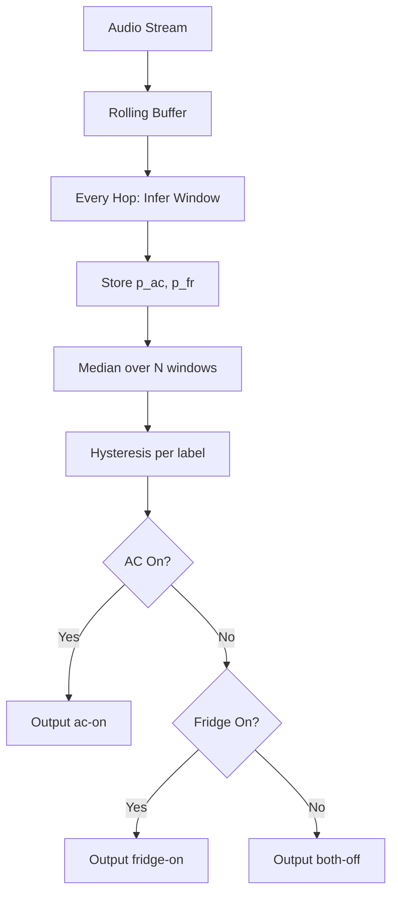

# SPEC: Apartment Noise State Classifier (AC / Fridge / Neither)

## 1) Purpose and Scope
Build a **live noise detection system** for a **fixed apartment, fixed microphone position** that reports one of three states:

1. **"ac-on"** — AC blower is on (fridge may be on or off).
2. **"fridge-on"** — AC is off and fridge compressor is on.
3. **"both-off"** — neither AC blower nor fridge compressor is on.

The system must include **data preparation, model training, evaluation, and inference (batch + streaming)**. It must use **BEATs_iter3_plus_AS2M.pt** as the encoder and the **BEATs reference preprocessing**. No backwards compatibility, fallback behaviors, or legacy code.

---

## 2) Core Strategy (as designed in BRAINSTORM.md)
### 2.1 Output Formulation
Train a **multi-label classifier** with two sigmoid outputs:
- `ac` ∈ {0,1}
- `fridge` ∈ {0,1}

Then derive the 3-state output:
- If `P(ac) > t_ac` → **"ac-on"** (priority)
- Else if `P(fridge) > t_fr` → **"fridge-on"**
- Else → **"both-off"**

**Rationale:** AC and fridge are independent sources. This uses “both-on” recordings to improve `ac` and `fridge` detectors instead of forcing a 3-way softmax.

### 2.2 High-Level Components
- **Data Preparation**: resample, mono conversion, windowing, outlier removal.
- **Augmentation**: gain, in-domain noise mixing, EQ tilt, SpecAugment.
- **Feature Extraction**: BEATs fbank pipeline (Kaldi fbank) with BEATs normalization.
- **Model**: BEATs encoder + pooling + small MLP head.
- **Training**: freeze-first, optional partial unfreeze, file-level splits.
- **Evaluation**: file-level aggregation, metrics aligned with deployment.
- **Inference**: batch file scoring and streaming with robust aggregation + hysteresis.

---

## 3) Data and Inputs
### 3.1 Source Recordings
- Location: `./samples`
- Format: `.m4a`, steady-state ~3-minute clips
- Sample rate: **44.1 kHz**
- Recorded at a **fixed mic position**
- Labels map to steady-state AC/fridge conditions.

### 3.2 Label Mapping
Four physical conditions exist (AC × Fridge), but target outputs are 3 states:
- **ac-on**: AC on, fridge either on or off
- **fridge-on**: AC off, fridge on
- **both-off**: AC off, fridge off

In multi-label training, use:
- `ac = 1` if AC on
- `fridge = 1` if fridge on

---

## 4) Preprocessing and Windowing
### 4.1 Audio Preprocessing (Must Match BEATs)
BEATs expects Kaldi fbank features with:
- `sample_frequency = 16000`
- `num_mel_bins = 128`
- `frame_length = 25 ms`
- `frame_shift = 10 ms`
- Normalize as: `(fbank - mean) / (2 * std)`
- Use BEATs repo preprocessing to avoid mismatch

**Steps:**
1. Resample from 44.1 kHz → **16 kHz**
2. Convert to mono
3. Apply BEATs fbank pipeline

### 4.2 Windowing
Generate multiple examples from each 3-minute clip.

Defaults:
- **Window length:** 6.0 s
- **Hop length:** 1.5 s

This yields ~117 windows per 3-minute clip.

### 4.3 Outlier Removal
Remove rare non-steady events (footsteps, clanks, speech).

Per source file:
- Compute RMS (optionally spectral flux) per window
- Drop top **~1%** most energetic windows

---

## 5) Data Augmentation
All augmentations are **on-the-fly**.

### 5.1 Waveform-Domain
- **Random gain:** ±6 dB (always)
- **In-domain noise mixing:**
  - With 50% probability, mix a random **both-off** window
  - SNR uniform in [8, 25] dB
- **EQ tilt (30% probability):**
  - Low-shelf at 150–300 Hz: ±3 dB
  - High-shelf at 2–5 kHz: ±3 dB

### 5.2 Feature-Domain
- **SpecAugment (always):**
  - Time masks: 2 masks, up to ~0.4 s worth of frames each
  - Freq masks: 2 masks, up to 20 mel bins

### 5.3 Avoid
- Heavy reverbs / room impulse responses
- Large time-stretching

---

## 6) Model Architecture
### 6.1 Encoder
- **BEATs_iter3_plus_AS2M.pt** (pretrained)
- Frozen by default in Stage 1

### 6.2 Pooling (default)
**Attention pooling** over BEATs frame embeddings:
- `h_t ∈ R^D` from BEATs
- `α_t = softmax(wᵀ h_t)`
- pooled = `Σ α_t h_t`

### 6.3 Head (default)
Small MLP:
- Dropout(0.2)
- Linear `D → 256`
- GELU
- Dropout(0.2)
- Linear `256 → 2` (outputs: `ac`, `fridge`)

### 6.4 Loss
- `BCEWithLogitsLoss`
- Use `pos_weight` if labels are imbalanced

---

## 7) Training Strategy
### 7.1 Two-Stage Training
**Stage 1 (required): head only**
- Freeze all BEATs parameters
- Optimizer: AdamW
- LR(head): 1e-3
- Weight decay: 1e-2
- Cosine decay, warmup ~200 steps
- Early stop on file-level validation metrics

**Stage 2 (optional): partial unfreeze**
- Unfreeze last 1–2 transformer blocks
- LR(unfrozen BEATs): 2e-5
- LR(head): 3e-4
- Weight decay: 1e-2
- Early stop; skip if validation degrades

### 7.2 Validation Splits
**File-level split only** (never random window split):
- Train on day files, validate on night files (and swap)
- Leave-one-recording-out is acceptable

### 7.3 Metrics (Aligned with Deployment)
- Aggregate window predictions per file using **median**
- Compute:
  - F1 for `ac`
  - F1 for `fridge`
  - 3-state accuracy after applying thresholds

---

## 8) Thresholding and State Derivation
### 8.1 Threshold Selection
- Choose `t_ac`, `t_fr` that maximize validation F1
- Starting defaults:
  - `t_ac = 0.75`
  - `t_fr = 0.70`

### 8.2 Hysteresis (Streaming Stability)
Use separate on/off thresholds:
- AC: `t_on = 0.80`, `t_off = 0.60`
- Fridge: `t_on = 0.75`, `t_off = 0.55`

**Switch logic**:
- OFF → ON if `p̂ ≥ t_on`
- ON → OFF if `p̂ ≤ t_off`

### 8.3 Priority Rule
If AC is ON, output **"ac-on"** even if fridge is also on.

---

## 9) Inference System
### 9.1 Batch Inference (file-based)
1. Load audio, resample to 16 kHz
2. Windowing (6 s / 1.5 s hop)
3. BEATs + head → window probabilities
4. Aggregate with median per file
5. Apply thresholds + priority rule
6. Output JSON:

```json
{"status": "ac-on" | "fridge-on" | "both-off"}
```

### 9.2 Streaming Inference (real-time)
**Defaults:**
- Window: 6.0 s
- Hop: 1.5 s
- Aggregation buffer: 7 windows (~10.5 s)

**Process:**
1. Maintain rolling audio buffer
2. Every hop, run inference on last window
3. Keep history of `p_ac`, `p_fr` for last `N=7` windows
4. Compute median `p̂_ac`, `p̂_fr`
5. Apply hysteresis per label
6. Derive 3-state output
7. Debounce final output (require K=2 consecutive updates)

---

## 10) System Interfaces and Artifacts
### 10.1 Inputs
- Audio recordings (`.m4a`, 44.1 kHz)
- Optional live mic input (streaming)

### 10.2 Outputs
- JSON status
- Optional debug: `p_ac`, `p_fridge`, aggregated medians

### 10.3 Artifacts
- Trained head weights
- Threshold config (`t_ac`, `t_fr`, hysteresis values)
- Train/val logs and metrics

---

## 11) Component Interaction Diagram
```mermaid
flowchart LR
  A[Samples: .m4a @44.1k] --> B[Resample to 16k + Mono]
  B --> C[Windowing 6s/1.5s hop]
  C --> D[Outlier Removal (top 1% RMS)]
  D --> E[Augmentation]
  E --> F[BEATs Preprocess (fbank)]
  F --> G[BEATs Encoder]
  G --> H[Pooling]
  H --> I[MLP Head (2 logits)]
  I --> J[Sigmoid]
  J --> K[Aggregation + Thresholds]
  K --> L[3-State Output]
```

---

## 12) Training Pipeline Diagram
```mermaid
flowchart TD
  A[Dataset Windows] --> B[File-Level Split]
  B --> C[Train Set]
  B --> D[Val Set]
  C --> E[Stage 1: Train Head Only]
  E --> F[Stage 2: Unfreeze Last Blocks (optional)]
  D --> G[Aggregate by File (Median)]
  G --> H[Compute F1 + Accuracy]
  H --> I[Pick Thresholds]
  I --> J[Final Model + Thresholds]
```

---

## 13) Streaming Decision Diagram


---

## 14) Parameter Defaults (Config Table)

| Category | Parameter | Default | Notes |
|---|---|---|---|
| Audio | resample_rate | 16000 | Must match BEATs fbank |
| Windowing | window_sec | 6.0 | Training + inference |
| Windowing | hop_sec | 1.5 | Training + inference |
| Outlier | drop_top_pct | 0.01 | Per file RMS |
| Augment | gain_db | ±6 | Always |
| Augment | mix_prob | 0.5 | Mix both-off window |
| Augment | mix_snr_db | 8–25 | Uniform |
| Augment | eq_prob | 0.3 | Mild EQ tilt |
| SpecAug | time_masks | 2 | Up to ~0.4s |
| SpecAug | freq_masks | 2 | Up to 20 bins |
| Train | stage1_lr | 1e-3 | Head only |
| Train | stage2_lr_beats | 2e-5 | Unfreeze last blocks |
| Train | stage2_lr_head | 3e-4 | Head in stage 2 |
| Train | weight_decay | 1e-2 | AdamW |
| Aggregation | agg_method | median | Robust |
| Aggregation | agg_window_n | 7 | ~10.5s history |
| Hysteresis | ac_on/off | 0.80 / 0.60 | Streaming |
| Hysteresis | fr_on/off | 0.75 / 0.55 | Streaming |
| Output | debounce_k | 2 | Consecutive updates |

---

## 15) Non-Goals
- Generalization to other apartments or microphone placements
- Multi-room inference
- Backwards compatibility with legacy systems
- Fallback classifiers (no energy-only shortcut in final output)

---

## 16) Implementation Notes
- Always run Python scripts via **`uv`**.
- Use BEATs reference preprocessing for feature extraction to avoid mismatches.
- File-level validation is mandatory; random window splits are invalid.
- Aggregation logic must match deployment (median + hysteresis).

---

## 17) Acceptance Criteria
- Model trains successfully on provided recordings without data leakage.
- File-level validation demonstrates stable, high F1 for `ac` and `fridge`.
- Streaming inference produces stable state output with minimal flapping.
- CLI outputs valid JSON with exact status values.
